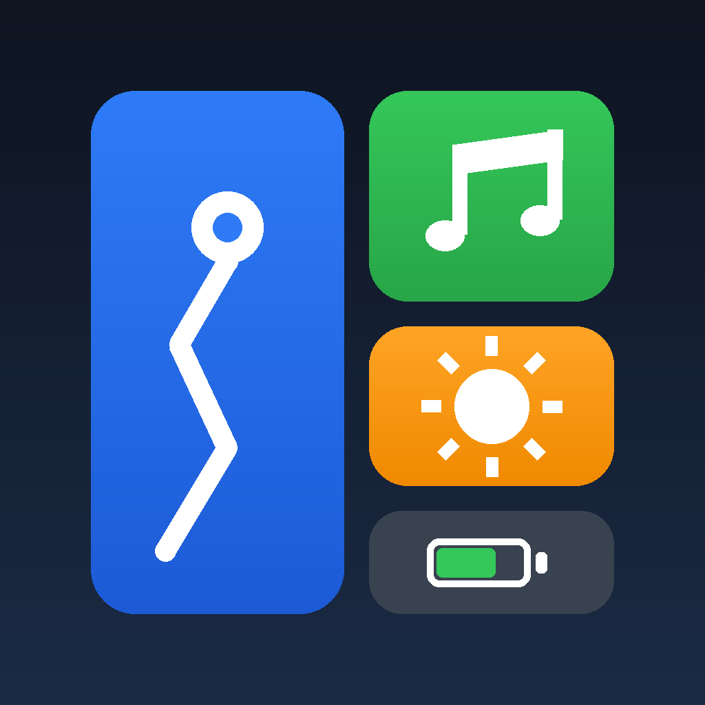
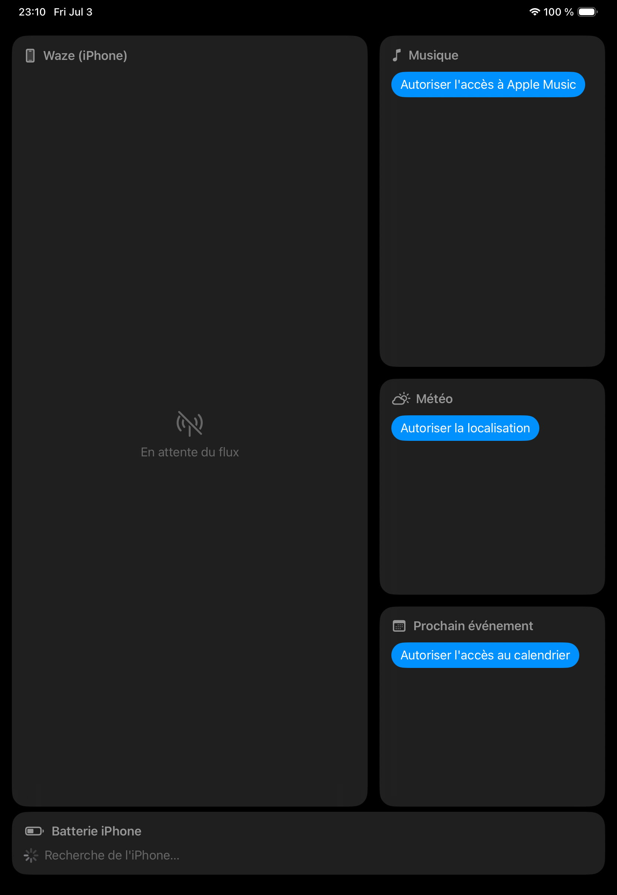
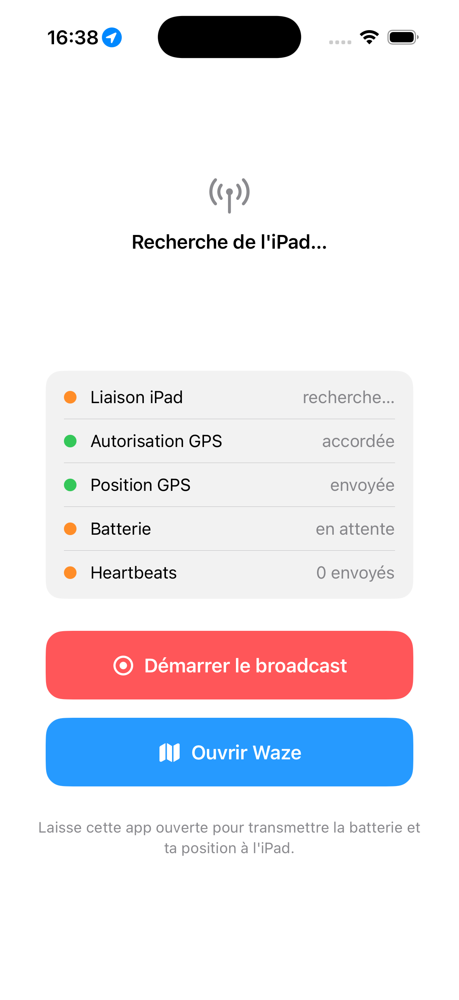

<p align="center">
  
</p>

# CarDashboard

Dashboard de voiture « CarPlay maison » : une app iPad qui affiche en temps réel le **mirroring de Waze depuis un iPhone**, la musique en cours, la météo et des contacts d'appel rapide — le tout sans serveur, sans Internet requis, et sans compte développeur payant.

L'iPad est fixé au tableau de bord, l'iPhone reste dans son support avec Waze ouvert. Les deux communiquent en direct via le hotspot de l'iPhone.

| iPad (dashboard) | iPhone (companion) |
|:---:|:---:|
|  |  |

## Fonctionnalités

- 🗺️ **Mirroring Waze** — l'écran de l'iPhone est capturé (ReplayKit), encodé en H.264 (VideoToolbox) et diffusé vers l'iPad en local
- 🎵 **Musique** — widget Apple Music interactif : lecture/pause, précédent/suivant, lancement de playlists (MusicKit / MediaPlayer)
- 🌤️ **Météo** — conditions actuelles + 6 prochaines heures (Open-Meteo, sans clé API), localisée via le GPS de l'iPhone relayé à l'iPad
- 📞 **Appels rapides** — contacts favoris configurables, appel en un tap
- 🔋 **Batterie iPhone** — niveau affiché en continu sur l'iPad
- 🔄 **Layout adaptatif** — bascule automatique portrait/paysage, zone Waze dimensionnée au ratio exact de l'iPhone
- 🩺 **Écran de diagnostic** — au démarrage, un panneau montre en direct l'état de la liaison (connexion, batterie, position, config vidéo, paquets reçus) des deux côtés, puis entre automatiquement dans le dashboard une fois la liaison établie

## Architecture

Trois cibles Xcode :

```
CarDashboard/            App iPad (SwiftUI) — le dashboard
CarDashboardCompanion/   App iPhone — boutons broadcast/Waze, envoi batterie + GPS
BroadcastExtension/      Broadcast Upload Extension (ReplayKit) — capture d'écran iPhone
Shared/                  Transport Multipeer Connectivity + protocole de messages
```

**Transport** : [Multipeer Connectivity](https://developer.apple.com/documentation/multipeerconnectivity) — découverte automatique via Bonjour, pas de serveur, fonctionne sur le réseau local du hotspot. Un seul canal transporte la vidéo et les messages de données (batterie, position GPS, config décodeur).

**Robustesse de la liaison** : l'iPad ne maintient qu'une connexion à la fois avec l'iPhone, alors que celui-ci expose deux pairs (l'app companion et l'extension broadcast). Le pair vidéo est donc prioritaire : lancer le broadcast bascule la connexion sur l'extension (qui relaie aussi la batterie), et l'arrêter la ramène sur le companion. Un heartbeat + watchdog détectent les sessions mortes et relancent la découverte automatiquement ; la position GPS de l'iPad sert de repli météo quand celle de l'iPhone n'est pas disponible.

**Pipeline vidéo** : capture ReplayKit → encodage H.264 temps réel (VideoToolbox, limite mémoire de 50 Mo de l'extension oblige) → envoi hybride (keyframes en fiable, inter-frames en non-fiable pour éviter le head-of-line blocking) → décodage VTDecompressionSession côté iPad.

## Prérequis

- Xcode 15+, un iPad et un iPhone
- Un compte développeur Apple **gratuit** suffit (re-signature tous les 7 jours)
- iPhone et iPad sur le même réseau (partage de connexion de l'iPhone)

## Installation

1. Ouvrir `CarDashboard.xcodeproj`, régler le Team de signature sur les 3 cibles
2. Scheme **CarDashboard** → installer sur l'iPad
3. Scheme **CarDashboardCompanion** → installer sur l'iPhone (l'extension broadcast est embarquée)
4. Sur l'iPhone : ouvrir le companion → **Démarrer le broadcast** → **Ouvrir Waze**
5. Le flux apparaît sur l'iPad automatiquement dès que les appareils se trouvent

## Notes techniques

- Le broadcast ne peut être démarré que via le bouton système (`RPSystemBroadcastPickerView`) — restriction iOS
- `NSLocalNetworkUsageDescription` + `NSBonjourServices` sont requis des deux côtés, sinon Multipeer échoue silencieusement
- La config décodeur (SPS/PPS) est renvoyée à chaque keyframe pour permettre à l'iPad de se (re)connecter en cours de diffusion

---

Projet personnel de [Clément Balcon](https://clementbalcon.github.io) — développé avec l'aide de Claude Code.
